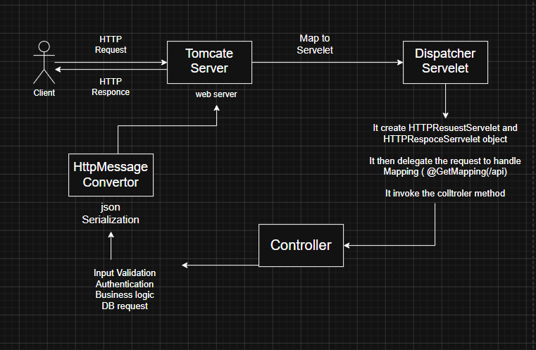
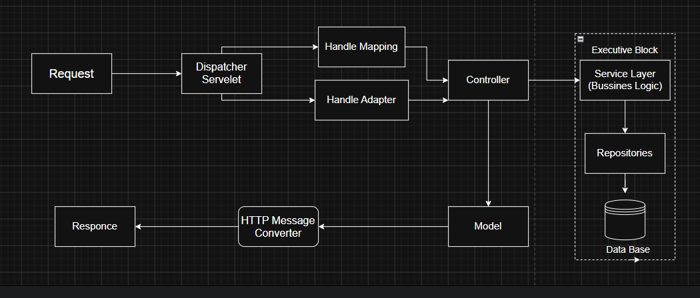

                                            RECAPE              
----------> Spring Boot Web and MVC Architecture <-----------

------> Servelet <-------
A servelet is a java class that run inside the web server and handle HTTP Request and HTTP Responce.

------> Dispatcher Servelet <--------
A Dispatcher Servelet is a spring boot class that act as front Controller.

------> JSON Serialization <-------
It is the process of convertion java object into json formate

-----> Handler Adapter <-----
It is the bridge between DispatcherServelet and handler(Controller). It allow dispatcherServelet to work 
with different Controller implementation without being tightly couple them.

---------> 2. Presentation Layer <--------
Presentation layer is the user interface layer that interact with user directly.

Responsibilties  of presentation layer 
1 It send data to bussiness logic layer
2 It accept data from user
3 Display information to user 

-------> 3. Business Logic layer/ Services Layer <--------
It perform business logic, calculation and apply decision making to user input.

Responsibilities of business logic layer
1 Do mathematic calculation and processing.
2 Apply business rules
3 Enforce decision making policies and rules.
4 Coordinate dataflow between presentation layer and data access layer.
5 Validate user input according to business requirements.

-------> 4. Prsistense Layer <--------
It is responsible for storing, updating, retriveing and deleting data from database.

Resposibilities of persistence layer 
1 Connect to database
2 Implements SQL Queries
3 Hide data specifics details from business layer
4 Save object in database
5 Retrive data from database
6 Update and delete data from database

-------> 5 Exception handling in Spring Boot MVC <-------
It is a mechanisim that handle and catch error that occure during request proscessing, so the application can  return meaningful responce instead of crashing and showing stack trash.

-------> 6 Input Validation Annotation <----------
It automatically validate user input before reaching business logic layer.
They are the part of Bean validation API (Jakarta Validation).
